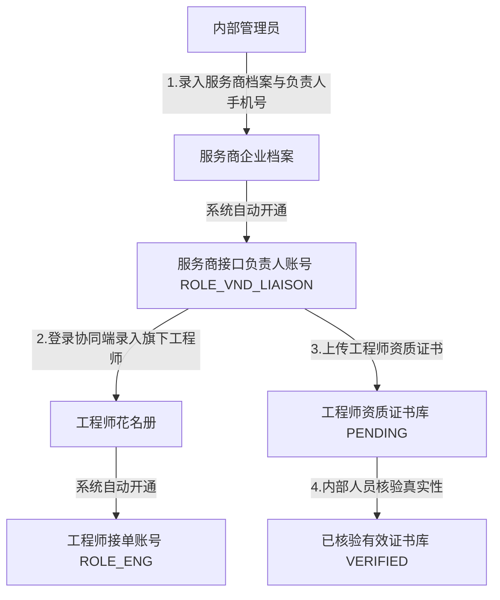
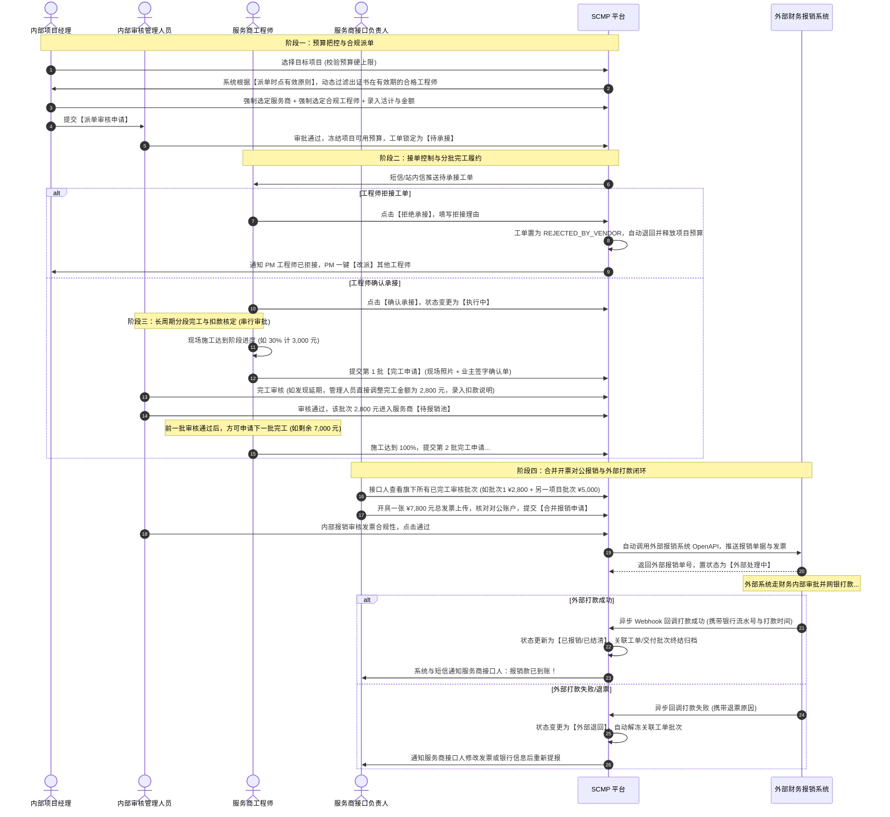
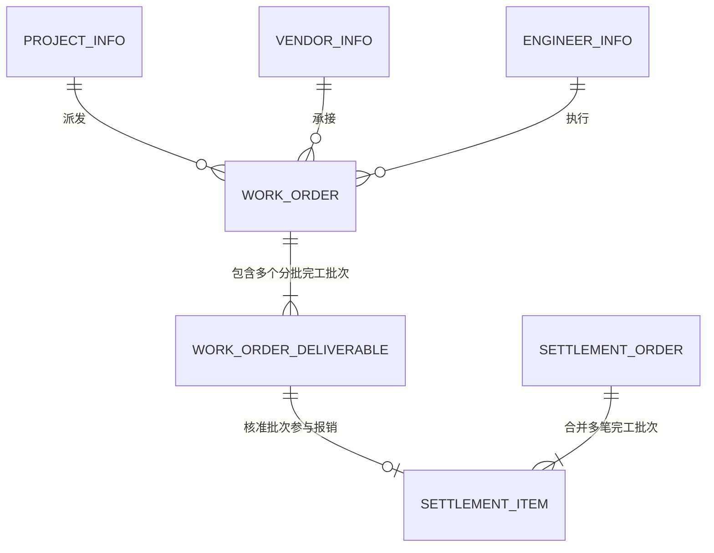

# 服务合作管理系统 (SCMP) 需求与系统设计规格说明书

> **文档版本**：v2.0.0 (全业务闭环深度研讨终版规格)  
> **编制日期**：2026-09-24  
> **状态**：详细设计规格定稿 (Design Frozen / Ready for Implementation)  
> **系统定位**：企业内外部协同、资质派工、多批次履约验收与外部财务系统对接中台

---

## 一、 系统全景定位与业务边界

**服务合作管理系统（SCMP）** 是企业内外部协同与工程/劳务分包管控的核心中枢。系统上承企业项目预算与合规准入，下接外部服务商机构及其持证工程师，**横向与企业现有的外部财务报销系统（ERP/费用中台）实现无缝数据集成与异步打款回调闭环**。

```
┌────────────────────────────────────────────────────────────────────────┐
│                        企业内部协同层 (Internal)                        │
│   项目经理 (PM)      │   审核管理人员 (Auditor)  │   外部系统对接网关   │
└───────────┬──────────────────────────┬─────────────────────────┬───────┘
            │ 1.预算/资质派单          │ 2.派单/分批完工/报销审核│ 3.推送报销
            ▼                          ▼                         ▼
┌──────────────────────────┐┌──────────────────────────┐┌────────────────┐
│   SCMP 核心业务中枢      ││   资质证书与规则引擎     ││ 外部报销系统   │
│   项目预算硬管控 /       ││   项目证书门槛(AND/OR) ⟷ ││ (ERP/费用中台) │
│   工单分段完工 / 扣款核定││   派单时点有效性强校验   ││                │
└───────────┬──────────────┘└──────────────────────────┘└───────┬────────┘
            │                                                   │ 4.打款完成
            │ 工程师接单/履约/分批完工提报                       │   异步回调
            │ 接口负责人对公合并报销                            ▼
┌───────────┴────────────────────────────────────────────────────────────┐
│                       服务商外部协同层 (Vendor)                         │
│       服务商工程师 (Field Engineer)   │   服务商接口负责人 (Liaison)    │
└────────────────────────────────────────────────────────────────────────┘
```

---

## 二、 用户角色与账号层级自动化模型



### 1. 角色矩阵与职责权限表

| 角色代码 | 角色名称 | 所属端 | 核心权限与业务职责 |
| :--- | :--- | :--- | :--- |
| `ROLE_PM` | **项目经理** | 内部管理端 | 1. 项目立项，监控委外派单预算（硬上限，不可超额派单）；<br>2. **强制双选派单**：必须指定服务商，必须指定持有有效证书的工程师；<br>3. 在途费用调整（调增需管理人员复核，调减直接释放预算）；<br>4. 拥有接单前【主动撤回派单】权限；收到工程师拒接通知后一键【改派】。 |
| `ROLE_AUDITOR` | **审核管理人员** | 内部管理端 | 1. **派单审批**：审核活计内容与预算合理性；<br>2. **分批完工验收审核**：对比现场图文与客户签字单，**可直接核减完工金额并填写扣款理由**；终审判定锁定实付金额；<br>3. **报销审核**：核查发票合规性，审批通过后自动外发推单至外部报销系统；<br>4. 内部核验服务商上传的工程师资质证书（`PENDING -> VERIFIED`）。 |
| `ROLE_ADMIN` | **系统管理员** | 内部管理端 | 1. 录入合作服务商档案与负责人手机号（自动开通负责人账号）；<br>2. 维护系统标准证书类型库；<br>3. **独家权限**：凭借加盖公章的线下申请函，修改服务商对公银行账户；<br>4. 监控外部报销系统的接口调用与打款回调日志。 |
| `ROLE_VND_LIAISON` | **服务商接口负责人** | 服务商协同端 | 1. 自行维护旗下工程师档案（自动开通接单账号），上传资质证书及有效期；<br>2. 查看本公司所有工程师承接项目的分批履约进度与扣款通知；<br>3. **唯一报销申报人**：调取旗下所有已完工验收批次，**支持单笔或多批次合并开具 1 张总发票批量申报**；<br>4. 接收外部财务报销系统的打款进度与流水到账通知。 |
| `ROLE_ENG` | **服务商工程师** | 服务商协同端 | 1. 查收指派给本人的工单，确认承接去干活或拒接（拒接自动退回预算）；<br>2. 现场施工作业，支持按进度（如 30%、60%、100%）**分批提交完工申请与签字单**；<br>3. *前一笔完工未通过前禁止提报下一笔；无报销申报权限*。 |

---

## 三、 全业务时序与核心闭环流转



---

## 四、 核心业务规则深度技术规范

### 1. 项目预算硬上限与在途费用变更
*   **硬性预算红线**：
    *   项目委外总预算（`total_budget`）为绝对上限，系统强校验：
        $$\sum \text{WorkOrder.amount} \le \text{Project.total\_budget}$$
    *   PM 发起派单或调整金额时，若超出项目剩余可用额度，后端底层强行拦截抛出异常。
    *   **预算扩容机制**：仅当项目在系统中正式办理了“项目预算追加流程”（如总预算从 10,000 追加到 15,000 元），才允许追加派单或向上调整工单金额。
*   **在途工单费用变更权限**：
    *   **调增金额**：PM 申请调增金额必须经内部管理人员审批通过后方可生效，防止私下加钱；管理人员自身有权直接调整；
    *   **调减金额**：PM 或管理人员调减金额，差额部分立即释放回项目可用预算；
    *   **通知机制**：只要工单金额发生变动，系统自动向服务商接口人与履约工程师触发短信与站内信通知；
    *   **换人熔断**：若涉及更换服务商或更换工程师，必须撤回退回草稿箱，重新发起审批，严禁在途随意更换主体。

### 2. 分批完工申请与流水控制机制
*   **进度比例完工**：
    *   长周期工单，工程师可按实际完成进度分段提报（如 30%、60%、100%），填写本期申请完工金额（`apply_amount`）并上传本期成果与业主签字单；
*   **串行审批约束**：
    *   **强控制**：前一笔完工申请处于 `PENDING` 审核中时，系统禁止工程师提交下一批完工申请。必须等内部管理人员对前一笔审批通过（或驳回整改完成）后，方可开启下一批申请。
*   **完工与报销完全解耦**：
    *   第 1 批完工审核通过后，服务商接口人可以不立即报销，继续等待第 2 批完工；
    *   服务商接口人可在后续任意时间，自主选择单笔报销或将多个已核准批次打包报销。

### 3. 完工核减扣款与终审锁定机制 (已裁定 B1)
*   **扣款前置**：内部人员扣款不在报销阶段发生，统一在完工验收阶段处理。
*   **扣款执行**：
    *   工程师申请完工金额 1,000 元，审核人员若发现工期延误或施工瑕疵，可直接在审核界面调整核定完工金额为 800 元，并录入扣款原因；
    *   审核通过瞬间，系统向服务商发送扣款明细通知；
    *   **终审锁定（B1）**：管理人员核定通过即为最终结论，锁定的 800 元直接作为该批次“纯净核定金额”进入待报销池，服务商据此金额开票，杜绝报销税务差额争议。

### 4. 合并开票与外部报销系统推单 (已裁定 A1)
*   **汇总开大票**：服务商接口人勾选多笔完工记录合并报销时，**允许开具 1 张总金额相符的增值税专用发票**，无需按工单逐一开票。
*   **外部系统对接闭环**：
    *   内部审核人员对报销单及发票初审通过后，系统自动调用外部报销系统 OpenAPI 推送单据；
    *   外部系统完成审批与网银打款后，触发 Webhook 回调 SCMP，SCMP 更新状态为 `PAID`，释放所有锁定归档，全链条闭环。
    *   外部退票失败时，SCMP 自动解冻工单批次，打回给接口人重新提交。

### 5. 服务商银行账户强管控 (已裁定 A)
*   系统严禁外部服务商自行在线修改对公银行信息；
*   修改账户必须提交线下盖公章的申请公函，由公司内部系统管理员统一在后台变更。

---

## 五、 MySQL 8.0 核心实体表结构设计 (DDL)



### 1. 工单分批完工提报凭证表 (`work_order_deliverable`)
> **核心升级**：支持分批完工申请金额、核准实批金额、扣款原因与分批状态。
```sql
CREATE TABLE work_order_deliverable (
    id BIGINT NOT NULL PRIMARY KEY AUTO_INCREMENT COMMENT '交付批次主键ID',
    work_order_id BIGINT NOT NULL COMMENT '关联工单ID',
    batch_no INT NOT NULL DEFAULT 1 COMMENT '第几批次完工申请 (1, 2, 3...)',
    progress_percent DECIMAL(5,2) NOT NULL DEFAULT 100.00 COMMENT '本期完工累计进度百分比 (如 30.00%)',
    apply_amount DECIMAL(10,2) NOT NULL COMMENT '本期申请完工金额 (元)',
    approved_amount DECIMAL(10,2) DEFAULT NULL COMMENT '内部核定通过金额 (扣款后实际可报销金额)',
    deduction_amount DECIMAL(10,2) NOT NULL DEFAULT 0.00 COMMENT '审核扣款金额 (元)',
    deduction_reason VARCHAR(255) DEFAULT NULL COMMENT '完工扣款原因说明 (如工期延误/质量瑕疵)',
    summary TEXT DEFAULT NULL COMMENT '本期现场施工总结说明',
    attachment_urls JSON DEFAULT NULL COMMENT '本期现场实拍成果附件URL数组',
    sign_sheet_url VARCHAR(500) NOT NULL COMMENT '本期业主现场签字验收单扫描件 (必须上传)',
    audit_status VARCHAR(20) NOT NULL DEFAULT 'PENDING' COMMENT '审核状态: PENDING(待审核), APPROVED(审核合格), REJECTED(驳回整改)',
    audit_user_id BIGINT DEFAULT NULL COMMENT '审核管理人员用户ID',
    audit_time DATETIME DEFAULT NULL COMMENT '审核完成时间',
    audit_comment VARCHAR(255) DEFAULT NULL COMMENT '审核综合意见',
    settle_status VARCHAR(20) NOT NULL DEFAULT 'UNSETTLED' COMMENT '报销状态: UNSETTLED(未报销), SETTLING(报销审批中), SETTLED(已报销到账)',
    create_time DATETIME DEFAULT CURRENT_TIMESTAMP COMMENT '申请提报时间',
    update_time DATETIME DEFAULT CURRENT_TIMESTAMP ON UPDATE CURRENT_TIMESTAMP COMMENT '更新时间',
    INDEX idx_wo_batch (work_order_id, batch_no),
    INDEX idx_settle_pool (settle_status, audit_status)
) ENGINE=InnoDB DEFAULT CHARSET=utf8mb4 COMMENT='工单分批完工验收与核减明细表';
```

### 2. 工单主表 (`work_order`)
```sql
CREATE TABLE work_order (
    id BIGINT NOT NULL PRIMARY KEY AUTO_INCREMENT COMMENT '工单主键ID',
    order_no VARCHAR(64) NOT NULL UNIQUE COMMENT '工单编号 (WO-yyyyMMdd-XXXXX)',
    project_id BIGINT NOT NULL COMMENT '关联项目ID',
    vendor_id BIGINT NOT NULL COMMENT '指定服务商ID (必选)',
    engineer_id BIGINT NOT NULL COMMENT '指定工程师ID (必选且需证书有效)',
    title VARCHAR(150) NOT NULL COMMENT '工单活计概述',
    work_content TEXT DEFAULT NULL COMMENT '交付技术标准',
    amount DECIMAL(10,2) NOT NULL DEFAULT 0.00 COMMENT '工单总合同金额 (给多少钱/元)',
    completed_amount DECIMAL(10,2) NOT NULL DEFAULT 0.00 COMMENT '累计已核准完工总金额',
    settled_amount DECIMAL(10,2) NOT NULL DEFAULT 0.00 COMMENT '累计已报销打款总金额',
    deadline DATETIME DEFAULT NULL COMMENT '要求完工截止时限',
    status VARCHAR(30) NOT NULL DEFAULT 'DRAFT' COMMENT 'DRAFT, PENDING_DISPATCH_AUDIT, DISPATCH_REJECTED, PENDING_ACCEPTANCE, IN_PROGRESS, REJECTED_BY_VENDOR, ALL_COMPLETED, CLOSED',
    cert_snapshot JSON DEFAULT NULL COMMENT '派单时工程师资质快照',
    reject_reason VARCHAR(255) DEFAULT NULL COMMENT '工程师拒接原因',
    accepted_at DATETIME DEFAULT NULL COMMENT '工程师确认接单时间',
    create_by BIGINT NOT NULL COMMENT '发起派单 PM ID',
    create_time DATETIME DEFAULT CURRENT_TIMESTAMP COMMENT '派单创建时间',
    update_time DATETIME DEFAULT CURRENT_TIMESTAMP ON UPDATE CURRENT_TIMESTAMP COMMENT '更新时间',
    INDEX idx_wo_proj (project_id),
    INDEX idx_wo_vnd (vendor_id),
    INDEX idx_wo_eng (engineer_id),
    INDEX idx_wo_status (status)
) ENGINE=InnoDB DEFAULT CHARSET=utf8mb4 COMMENT='工单主表';
```

### 3. 结算报销单主表 (`settlement_order`)
```sql
CREATE TABLE settlement_order (
    id BIGINT NOT NULL PRIMARY KEY AUTO_INCREMENT COMMENT '结算单主键ID',
    settle_no VARCHAR(64) NOT NULL UNIQUE COMMENT '报销单号 (ST-yyyyMMdd-XXXXX)',
    vendor_id BIGINT NOT NULL COMMENT '服务商企业ID',
    applicant_id BIGINT NOT NULL COMMENT '发起申报的接口负责人用户ID',
    deliverable_count INT NOT NULL DEFAULT 1 COMMENT '合并的完工批次总数',
    total_approved_amount DECIMAL(12,2) NOT NULL DEFAULT 0.00 COMMENT '合并完工核定实付款总额 (元)',
    extra_expense DECIMAL(10,2) NOT NULL DEFAULT 0.00 COMMENT '额外差旅辅材补贴申报金额',
    final_settle_amount DECIMAL(12,2) NOT NULL DEFAULT 0.00 COMMENT '最终向外部系统报销总额 (发票金额需与之一致)',
    bank_snapshot JSON DEFAULT NULL COMMENT '服务商对公银行账户快照',
    invoice_urls JSON DEFAULT NULL COMMENT '汇总增值税发票附件URL数组 (1张或多张)',
    status VARCHAR(30) NOT NULL DEFAULT 'PENDING_APPROVAL' COMMENT 'PENDING_APPROVAL, SETTLE_REJECTED, APPROVED_WAIT_PUSH, EXTERNAL_PROCESSING, PAID, EXTERNAL_FAILED',
    external_bill_no VARCHAR(100) DEFAULT NULL COMMENT '外部报销系统返回的审批流水号',
    pay_serial_no VARCHAR(100) DEFAULT NULL COMMENT '银行付款转账流水号',
    pay_time DATETIME DEFAULT NULL COMMENT '实际打款到账时间',
    create_time DATETIME DEFAULT CURRENT_TIMESTAMP COMMENT '申请时间',
    update_time DATETIME DEFAULT CURRENT_TIMESTAMP ON UPDATE CURRENT_TIMESTAMP COMMENT '更新时间',
    INDEX idx_settle_vnd (vendor_id),
    INDEX idx_settle_ext (external_bill_no)
) ENGINE=InnoDB DEFAULT CHARSET=utf8mb4 COMMENT='服务商报销结算主表';
```

### 4. 结算关联完工批次明细表 (`settlement_item`)
```sql
CREATE TABLE settlement_item (
    id BIGINT NOT NULL PRIMARY KEY AUTO_INCREMENT COMMENT '明细主键ID',
    settlement_id BIGINT NOT NULL COMMENT '关联结算单主表ID',
    deliverable_id BIGINT NOT NULL COMMENT '关联的完工批次ID (work_order_deliverable.id)',
    work_order_id BIGINT NOT NULL COMMENT '关联的工单ID',
    settle_amount DECIMAL(10,2) NOT NULL DEFAULT 0.00 COMMENT '该批次核算计入报销金额',
    create_time DATETIME DEFAULT CURRENT_TIMESTAMP COMMENT '挂接时间',
    INDEX idx_item_settle (settlement_id),
    INDEX idx_item_deliv (deliverable_id)
) ENGINE=InnoDB DEFAULT CHARSET=utf8mb4 COMMENT='结算报销关联完工批次明细表';
```

---

## 六、 结论与终版冻结声明

经过两轮系统化访谈与深度压力测试，本规格说明书（v2.0.0）已覆盖系统的全部业务闭环：
- [x] 角色与双端动态隔离架构
- [x] 账号层级与证书准入核验流
- [x] 项目预算硬管控与在途费用变更
- [x] 派单时点证书时效性强匹配引擎
- [x] 工程师拒接自动解冻预算与撤回改派
- [x] 长周期工程分批完工串行审批控制
- [x] 完工阶段核减扣款与终审锁定机制
- [x] 服务商合并开具总发票报销
- [x] 外部财务报销系统推单与异步 Webhook 回调打款闭环
- [x] MySQL 8.0 规范化 DDL 建模

**本设计规格文档已正式定稿冻结，处于完备就绪状态！**
